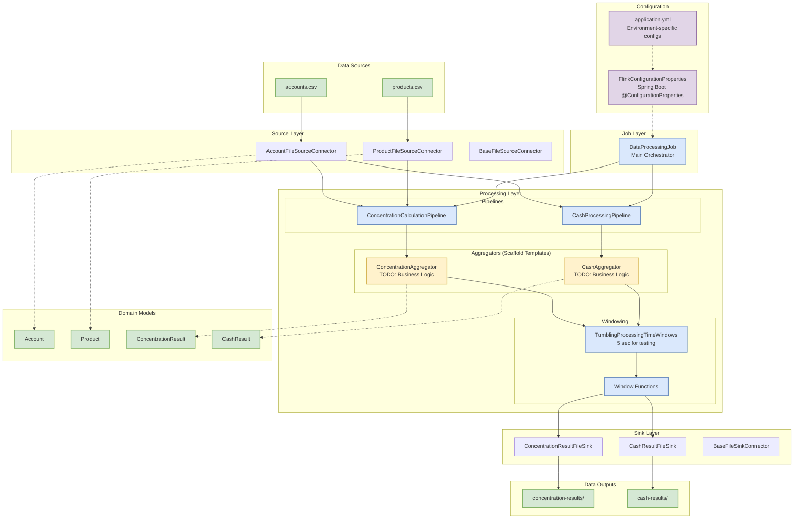

# Flink Data Processing Platform

Enterprise-grade Apache Flink application scaffold for real-time data processing with Spring Boot integration.

## Architecture Overview



## Technical Architecture & Functionality

### **Scaffold Architecture Layers**

```
┌─────────────────────────────────────────────────────────────────┐
│                    FLINK APPLICATION SCAFFOLD                  │
├─────────────────────────────────────────────────────────────────┤
│  🏗️  SCAFFOLD FEATURES                                         │
│  • TODO-marked placeholder business logic                      │
│  • Configurable components via Spring Boot                     │
│  • Sample data generation utilities                            │
│  • Integration testing with MiniCluster                        │
│  • Production-ready structure                                  │
└─────────────────────────────────────────────────────────────────┘

┌─────────────────┐    ┌──────────────────┐    ┌─────────────────┐
│ 📂 Source       │────▶│ ⚙️  Processing    │────▶│ 💾 Sink         │
│ Layer           │    │ Layer            │    │ Layer           │
├─────────────────┤    ├──────────────────┤    ├─────────────────┤
│ • File Sources  │    │ • Pipelines      │    │ • File Sinks    │
│ • CSV Readers   │    │ • Aggregators    │    │ • CSV Writers   │
│ • Deserializers │    │ • Windowing      │    │ • Bucket Assign │
│ • Validation    │    │ • Business Logic │    │ • Rolling Policy│
└─────────────────┘    │   (TODO Templates)│    └─────────────────┘
                       └──────────────────┘

┌─────────────────────────────────────────────────────────────────┐
│                    SPRING BOOT INTEGRATION                     │
├─────────────────────────────────────────────────────────────────┤
│ 🔧 Configuration Management                                     │
│ • @ConfigurationProperties binding                             │
│ • Environment-specific YAML configs                            │
│ • Externalized parameters (paths, parallelism, windows)        │
│ • Profile-based deployment (dev, test, prod)                   │
└─────────────────────────────────────────────────────────────────┘

┌─────────────────────────────────────────────────────────────────┐
│                       DOMAIN MODELS                            │
├─────────────────────────────────────────────────────────────────┤
│ 📊 Input Models          │  📈 Output Models                   │
│ • Account                │  • ConcentrationResult             │
│ • Product                │  • CashResult                      │
│                          │                                     │
│ 🎯 Scaffold Features:                                          │
│ • Immutable design pattern                                     │
│ • Flink serialization compatible                               │
│ • Validation-ready structure                                   │
└─────────────────────────────────────────────────────────────────┘
```

### **Data Processing Flow**

```
Input Files                Processing Pipeline              Output Files
┌──────────────┐          ┌─────────────────────────┐       ┌──────────────┐
│ accounts.csv │──────────▶│   Account Stream        │       │concentration-│
│              │          │                         │       │results/      │
│ • 20 records │          │ ┌─────────────────────┐ │──────▶│              │
│ • Test data  │          │ │ ConcentrationPipeline│ │       │ • CSV format │
└──────────────┘          │ │ • TODO: Risk Calc   │ │       │ • Bucketed   │
                          │ │ • Window Aggregation│ │       └──────────────┘
┌──────────────┐          │ └─────────────────────┘ │
│ products.csv │──────────▶│                         │       ┌──────────────┐
│              │          │ ┌─────────────────────┐ │       │ cash-results/│
│ • 10 records │          │ │ CashPipeline        │ │──────▶│              │
│ • Test data  │          │ │ • TODO: Cash Logic  │ │       │ • CSV format │
└──────────────┘          │ │ • Window Aggregation│ │       │ • Bucketed   │
                          │ └─────────────────────┘ │       └──────────────┘
                          └─────────────────────────┘

🔄 Windowing Strategy: TumblingProcessingTimeWindows (5 seconds for testing)
⚡ Parallelism: Configurable (default: 1 for testing, 4 for production)
🎯 Aggregation: Placeholder templates with TODO markers for business logic
```

**Tech Stack**: Apache Flink 1.18.1, Spring Boot 3.2.0, Java 21, Maven 3.9+

## Quick Start

### Prerequisites
- Java 21+
- Maven 3.9+

### Local Development
```bash
# Clone and build
git clone <repository-url>
cd flink-skaffold
mvn clean package

# Run locally
java -jar target/flink-data-processing-*.jar

# Or run with Maven
mvn spring-boot:run
```

## Configuration

**Scaffold Configuration** via `application.yml` using Spring Boot `@ConfigurationProperties`:

```yaml
flink:
  application:
    name: "Integration Test Application"    # 🏗️ Scaffold app name
    version: "1.0.0-TEST"                  # Version for testing
    
  source:
    account:
      path: "./data/input/accounts.csv"    # ✅ Configurable input paths
    product:
      path: "./data/input/products.csv"    # ✅ Sample data included
      
  processing:
    parallelism: 1                          # 🧪 Single thread for testing
    concentration:
      window:
        size:
          ms: 5000                          # 5-second windows for testing
    cash:
      window:
        size:
          ms: 5000                          # Fast processing for validation
          
  sink:
    parallelism: 1                          # 📤 Single sink thread
    concentration:
      path: "./data/output/concentration-results"  # ✅ Configurable outputs
    cash:
      path: "./data/output/cash-results"           # ✅ Organized by type
      
  quality:
    validation:
      enabled: true                         # ✅ Validation framework ready
      
  metrics:
    enabled: true                           # 📊 Monitoring enabled

# 🏗️ Scaffold Features:
# • All paths externalized and configurable
# • Environment-specific overrides supported (application-{profile}.yml)
# • Test-optimized settings (short windows, low parallelism)
# • Production-ready structure with validation and metrics
```

### Environment-Specific Configuration

```bash
# 🧪 Development/Testing
spring.profiles.active=test
# Uses application-test.yml with fast processing settings

# 🚀 Production  
spring.profiles.active=prod
# Uses application-prod.yml with optimized settings:
# • Higher parallelism (4+ threads)
# • Longer windows (60+ seconds)
# • Enhanced monitoring and checkpointing
```

## Project Structure

```
flink-skaffold/                          # 🏗️ SCAFFOLD PROJECT ROOT
├── src/main/java/com/example/flink/
│   ├── FlinkDataProcessingApplication.java   # 🚀 Spring Boot main class
│   │
│   ├── config/                               # ⚙️ Configuration Management
│   │   └── FlinkConfigurationProperties.java # Spring Boot @ConfigurationProperties
│   │
│   ├── domain/model/                         # 📊 Domain Models (Immutable)
│   │   ├── Account.java                      # Financial account entity
│   │   ├── Product.java                      # Product information entity
│   │   ├── ConcentrationResult.java          # Risk concentration output
│   │   └── CashResult.java                   # Cash position output
│   │
│   ├── job/                                  # 🎯 Job Orchestration
│   │   └── DataProcessingJob.java            # Main Flink job coordinator
│   │
│   ├── processing/                           # ⚡ Processing Logic
│   │   ├── pipeline/                         # Processing pipelines
│   │   │   ├── ConcentrationCalculationPipeline.java # Risk calc template
│   │   │   ├── CashProcessingPipeline.java            # Cash calc template
│   │   │   └── DataProcessingPipeline.java            # Pipeline coordinator
│   │   │
│   │   └── aggregator/                       # 🏗️ SCAFFOLD AGGREGATORS
│   │       ├── ConcentrationAggregator.java  # TODO: Concentration logic
│   │       └── CashAggregator.java           # TODO: Cash logic
│   │
│   ├── connectors/                           # 🔌 Flink I/O Connectors
│   │   ├── source/                           # Data ingestion
│   │   │   ├── AccountFileSourceConnector.java
│   │   │   ├── ProductFileSourceConnector.java
│   │   │   ├── BaseFileSourceConnector.java
│   │   │   └── DataSourceConnector.java
│   │   │
│   │   ├── sink/                             # Data output
│   │   │   ├── ConcentrationResultFileSink.java
│   │   │   ├── CashResultFileSink.java
│   │   │   ├── BaseFileSinkConnector.java
│   │   │   ├── DataSinkConnector.java
│   │   │   └── DateTimeBucketAssigner.java
│   │   │
│   │   └── serialization/                    # Data format handling
│   │       ├── AccountDeserializer.java
│   │       ├── ProductDeserializer.java
│   │       └── DataSerializer.java
│   │
│   └── utils/                                # 🛠️ Utilities
│       ├── Constants.java                    # Application constants
│       └── ValidationUtils.java              # Validation helpers
│
├── src/test/java/                            # 🧪 Testing Framework
│   ├── integration/                          # End-to-end testing
│   │   └── FlinkDataProcessingIntegrationTest.java # MiniCluster testing
│   │
│   └── utils/                                # Test utilities
│       └── SampleDataGenerator.java          # Test data generation
│
├── src/test/resources/                       # 📋 Test Resources
│   ├── data/                                 # Sample test data
│   │   ├── accounts.csv                      # 20 sample accounts
│   │   └── products.csv                      # 10 sample products
│   │
│   └── application-test.yml                  # Test configuration
│
├── docs/                                     # 📚 Documentation
│   └── tech-stories/                         # Technical stories
│       └── TS-001-flink-application-scaffold.md # This scaffold story
│
├── pom.xml                                   # 📦 Maven configuration
├── README.md                                 # 📖 This documentation
└── .gitignore                                # 🚫 Git ignore rules

🏗️ SCAFFOLD FEATURES:
├── ✅ Production-ready structure
├── ✅ Spring Boot integration with externalized configuration
├── ✅ TODO-marked aggregators for business logic implementation
├── ✅ Sample data and integration testing framework
├── ✅ File-based connectors with configurable paths
├── ✅ Windowing support for time-based processing
├── ✅ Java 21 compatibility with module system support
└── ✅ Maven build with Shade plugin for deployment
```

## Development

### Running Tests
```bash
mvn test
```

### Running Application
```bash
# Development mode with auto-reload
mvn spring-boot:run

# Production - Streaming mode (default)
mvn clean package
java -jar target/flink-data-processing-*.jar --spring.profiles.active=prod

# Production - Batch mode for historical data
java -jar target/flink-data-processing-*.jar --spring.profiles.active=prod --flink.execution.mode=BATCH
```

### Code Quality
- All business constants externalized to `Constants.java`
- No hardcoded values in production code
- SLF4J logging throughout
- Pure aggregators without business logic
- **Execution mode agnostic** - Works in both STREAMING and BATCH modes

## Monitoring

- **Flink UI**: http://localhost:8081
- **Health Check**: `/health` endpoint
- **Metrics**: Configurable via `flink.metrics.enabled`

## Production Deployment

### Environment Variables
```bash
SPRING_PROFILES_ACTIVE=prod
FLINK_ENV_JAVA_OPTS="-Xmx2g -Xms1g"
FLINK_EXECUTION_MODE=STREAMING    # or BATCH
```

### Production Configuration
- Uses `application-prod.yml`
- Optimized for performance and resource usage
- Enhanced security and monitoring

---

**Requirements**: Enterprise Flink application supporting both batch and streaming execution modes
**Status**: Production Ready
**Execution Modes**: 
- **STREAMING**: Real-time processing with windowed operations (default)
- **BATCH**: Finite dataset processing for historical analysis and ETL
**License**: MIT
