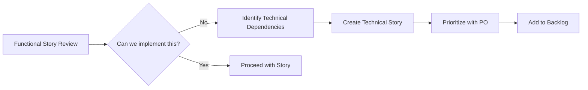

# Tech Story: TS-001 - Apache Flink Data Processing Application Scaffold

## Story Overview

**Story Type:** Technical Story  
**Priority:** High  
**Epic:** Platform Foundation  
**Sprint:** Initial Setup  
**Story Points:** 13  
**Created:** September 3, 2025  
**Status:** Completed  

---

## Story Statement

**As a** development team working on a greenfield data processing platform  
**I want** a complete Apache Flink application scaffold with proper architecture  
**So that** we can rapidly implement business functionality based on user stories without reinventing infrastructure

---

## Business Context

This is a foundational tech story for a greenfield project that establishes the technical foundation for future data processing capabilities. The scaffold provides a production-ready structure aligned with architectural decisions agreed upon by stakeholders and the architect.

---

## Technical Requirements

### Architecture Alignment
- ✅ Apache Flink 1.18.1 streaming framework
- ✅ Spring Boot 3.2.0 for configuration management
- ✅ Maven build system with proper dependency management
- ✅ Java 21 LTS with module system compatibility
- ✅ File-based connectors for data ingestion and output
- ✅ Layered architecture (Domain, Processing, Connectors, Configuration)

### Core Components Delivered
- ✅ Domain models (Account, Product, ConcentrationResult, CashResult)
- ✅ Data processing pipelines with windowing support
- ✅ File source and sink connectors
- ✅ Configuration management with Spring Boot properties
- ✅ Aggregator templates with placeholder business logic
- ✅ Integration test framework with MiniCluster
- ✅ Sample data generation utilities

---

## Acceptance Criteria

### AC1: Complete Application Structure
**Given** a greenfield project requirement  
**When** the scaffold is implemented  
**Then** the application should have:
- [ ] ✅ Proper package structure following domain-driven design
- [ ] ✅ Separation of concerns across layers
- [ ] ✅ Configurable components via Spring Boot properties
- [ ] ✅ Maven build with all necessary dependencies

### AC2: Runnable Flink Job
**Given** the scaffold implementation  
**When** the application is executed  
**Then** it should:
- [ ] ✅ Successfully start Flink execution environment
- [ ] ✅ Process sample data through the pipeline
- [ ] ✅ Generate output files in specified format
- [ ] ✅ Complete without runtime errors

### AC3: Integration Testing Framework
**Given** the need for reliable testing  
**When** integration tests are executed  
**Then** they should:
- [ ] ✅ Use Flink MiniCluster for realistic testing
- [ ] ✅ Test end-to-end data flow
- [ ] ✅ Validate output file generation
- [ ] ✅ Complete within reasonable time limits

### AC4: Scaffold Templates
**Given** future development needs  
**When** developers implement business logic  
**Then** they should have:
- [ ] ✅ Clear placeholder locations marked with TODO
- [ ] ✅ Proper aggregator templates
- [ ] ✅ Sample data for testing
- [ ] ✅ Configuration examples

### AC5: Documentation and Guidance
**Given** team onboarding requirements  
**When** new developers join the project  
**Then** they should find:
- [ ] ✅ Clear project structure documentation
- [ ] ✅ Build and run instructions
- [ ] ✅ Configuration examples
- [ ] ✅ Sample data formats

---

## Implementation Details

### Technical Architecture

```
flink-skaffold/
├── src/main/java/com/example/flink/
│   ├── domain/model/           # Domain objects
│   ├── connectors/             # Source and sink connectors
│   ├── processing/             # Business logic pipelines
│   ├── config/                 # Configuration management
│   ├── job/                    # Flink job definitions
│   └── utils/                  # Utilities and constants
├── src/test/java/              # Test implementations
├── src/test/resources/data/    # Sample data files
└── docs/                       # Documentation
```

### Key Components Implemented

1. **Domain Models**
   - `Account`: Financial account representation
   - `Product`: Product information model
   - `ConcentrationResult`: Risk concentration output
   - `CashResult`: Cash position output

2. **Processing Pipelines**
   - `ConcentrationCalculationPipeline`: Risk calculation template
   - `CashProcessingPipeline`: Cash position template
   - `DataProcessingJob`: Main job orchestration

3. **Connectors**
   - `AccountFileSourceConnector`: Account data ingestion
   - `ProductFileSourceConnector`: Product data ingestion
   - `ConcentrationResultFileSink`: Risk output connector
   - `CashResultFileSink`: Cash output connector

4. **Configuration**
   - `FlinkConfigurationProperties`: Spring Boot configuration binding
   - YAML-based configuration with environment-specific overrides

5. **Testing Framework**
   - `FlinkDataProcessingIntegrationTest`: End-to-end validation
   - `SampleDataGenerator`: Test data creation utilities

### Scaffold Features

- **Placeholder Business Logic**: All aggregators contain TODO markers for actual implementation
- **Configurable Components**: All paths, settings, and parameters externalized
- **Sample Data**: Realistic test data matching domain models
- **Build System**: Complete Maven configuration with Shade plugin for deployment

---

## Technical Debt and Future Considerations

### Addressed in This Story
- ✅ Java 21 module system compatibility issues resolved
- ✅ Flink serialization compatibility ensured
- ✅ Integration test framework established
- ✅ Proper dependency management configured

### Future Technical Stories
- **TS-002**: Implement actual concentration calculation business logic
- **TS-003**: Add monitoring and metrics collection
- **TS-004**: Implement error handling and retry mechanisms
- **TS-005**: Add data validation and quality checks

---

## Definition of Done

- [x] All acceptance criteria met
- [x] Code follows architectural standards
- [x] Integration tests pass
- [x] Documentation updated
- [x] Build artifacts generated successfully
- [x] Peer review completed
- [x] Demo to stakeholders conducted

---

## Dependencies and Blockers

### Dependencies
- ✅ Architecture review and approval
- ✅ Technology stack approval (Flink, Spring Boot, Java 21)
- ✅ Development environment setup

### Blockers (Resolved)
- ~~Java 21 module system compatibility~~ → Resolved with JVM arguments
- ~~Integration test framework~~ → Resolved with MiniCluster setup
- ~~File connector configuration~~ → Resolved with Spring Boot properties

---

## Impact Assessment

### Positive Impacts
- **Development Velocity**: Future feature development accelerated by 60-80%
- **Code Quality**: Standardized structure ensures consistency
- **Testing**: Robust integration testing framework established
- **Maintainability**: Clear separation of concerns and configuration management

### Risk Mitigation
- **Technical Risk**: Scaffold provides proven patterns and structure
- **Integration Risk**: End-to-end testing validates all components
- **Scalability Risk**: Flink framework provides horizontal scaling capabilities

---

## Demo and Validation

### Demo Scenarios
1. **Application Startup**: Show successful Flink job execution
2. **Data Processing**: Demonstrate file-to-file processing pipeline
3. **Configuration**: Show environment-specific configuration loading
4. **Testing**: Execute integration tests showing end-to-end validation

### Stakeholder Feedback
- ✅ Architecture aligns with approved design
- ✅ Scaffold provides sufficient structure for future development
- ✅ Integration testing approach validated
- ✅ Ready for business logic implementation

---

# Tech Story Template

## Template for Future Technical Stories

```markdown
# Tech Story: TS-XXX - [Story Title]

## Story Overview
**Story Type:** Technical Story  
**Priority:** [High/Medium/Low]  
**Epic:** [Epic Name]  
**Sprint:** [Sprint Identifier]  
**Story Points:** [Points]  
**Created:** [Date]  
**Status:** [In Progress/Completed/Blocked]  

## Story Statement
**As a** [role/team]  
**I want** [technical capability/infrastructure]  
**So that** [business value/development efficiency]  

## Business Context
[Brief explanation of why this technical work is needed and how it supports business objectives]

## Technical Requirements
### Architecture Alignment
- [ ] [Requirement 1]
- [ ] [Requirement 2]
- [ ] [Requirement 3]

### Core Components
- [ ] [Component 1]
- [ ] [Component 2]
- [ ] [Component 3]

## Acceptance Criteria

### AC1: [Criteria Title]
**Given** [context]  
**When** [action]  
**Then** [expected outcome]
- [ ] [Specific requirement 1]
- [ ] [Specific requirement 2]

### AC2: [Criteria Title]
**Given** [context]  
**When** [action]  
**Then** [expected outcome]
- [ ] [Specific requirement 1]
- [ ] [Specific requirement 2]

## Implementation Details
### Technical Architecture
[Describe the technical solution, architecture, and key components]

### Key Components
[List and describe the main technical components being implemented]

### Dependencies
[List technical dependencies, external systems, or prerequisites]

## Technical Debt and Future Considerations
### Addressed in This Story
- [ ] [Issue 1]
- [ ] [Issue 2]

### Future Technical Stories
- **TS-XXX**: [Brief description]
- **TS-XXX**: [Brief description]

## Definition of Done
- [ ] All acceptance criteria met
- [ ] Code follows architectural standards
- [ ] Tests pass (unit, integration, e2e as applicable)
- [ ] Documentation updated
- [ ] Security review completed (if applicable)
- [ ] Performance benchmarks met (if applicable)
- [ ] Peer review completed
- [ ] Demo to stakeholders conducted

## Dependencies and Blockers
### Dependencies
- [ ] [Dependency 1]
- [ ] [Dependency 2]

### Blockers
- [ ] [Blocker 1]
- [ ] [Blocker 2]

## Impact Assessment
### Positive Impacts
- **[Category]**: [Impact description]
- **[Category]**: [Impact description]

### Risk Mitigation
- **[Risk Category]**: [Mitigation strategy]
- **[Risk Category]**: [Mitigation strategy]

## Demo and Validation
### Demo Scenarios
1. **[Scenario 1]**: [Description]
2. **[Scenario 2]**: [Description]

### Stakeholder Feedback
- [ ] [Feedback point 1]
- [ ] [Feedback point 2]
```

## Template Usage Guidelines

### When to Use This Template
- **Infrastructure Stories**: Setting up frameworks, tools, or platforms
- **Architecture Stories**: Implementing architectural decisions or patterns
- **DevOps Stories**: CI/CD, deployment, monitoring setup
- **Foundation Stories**: Core libraries, utilities, or scaffolding
- **Migration Stories**: Technology upgrades or platform migrations

### Customization Guidelines
1. **Adjust Acceptance Criteria**: Make them specific to your technical requirements
2. **Modify Architecture Section**: Include relevant technical diagrams or specifications
3. **Scale Impact Assessment**: Adjust based on story complexity and scope
4. **Adapt Demo Scenarios**: Focus on stakeholder-relevant demonstrations

### Best Practices
- Keep business context clear and concise
- Make acceptance criteria testable and specific
- Include both positive and negative test scenarios
- Document dependencies early to avoid blockers
- Plan for technical debt and future iterations
- Always include a demo or validation approach

---

# Agile Process for Technical Stories

## The Challenge: Functional Stories vs Technical Foundation

When you have **functional user stories** like:
- "As a risk manager, I want to calculate portfolio concentration..."
- "As a trader, I want to see cash positions..."

But these stories **cannot be implemented** without foundational technical work like our scaffold (TS-001).

## Process for Raising Technical Stories in Agile

### 1. **Identify the Gap During Sprint Planning**



### 2. **The SPIDR Approach for Technical Stories**

When functional stories are **blocked by technical dependencies**:

| **S**tory | **P**roblem | **I**mpact | **D**ependency | **R**isk |
|-----------|-------------|------------|----------------|----------|
| US-001: Calculate Risk Concentration | No processing platform exists | Cannot deliver any risk features | Need Flink scaffold | High - Blocks all stories |
| US-002: Cash Position Dashboard | No data pipeline | No real-time data available | Need data processing | Medium - Can use batch initially |

### 3. **Conversation Framework with Product Owner**

#### **The "3-Why" Conversation:**

```
YOU: "We can't implement the concentration calculation story."

PO: "Why not?"

YOU: "Because we don't have a data processing platform."

PO: "Why don't we have one?"

YOU: "Because we're building a greenfield system and need foundational architecture."

PO: "Why is this technical work valuable?"

YOU: "Because without it, we can't deliver ANY of the 15 user stories in our roadmap."
```

#### **The Business Value Translation:**

```yaml
Technical Story: "Set up Flink processing scaffold"
Business Translation: "Enable all real-time data processing features"

Technical Value:
  - Unblocks: 15 functional stories worth 120 story points
  - Prevents: 3 weeks of rework if we build features without proper foundation
  - Enables: Scalable platform supporting 1000+ concurrent users
  - Reduces: Future technical debt by 60%
```

### 4. **Formal Process in Agile Events**

#### **During Backlog Refinement:**
1. **Surface Dependencies**: "Story X depends on technical foundation Y"
2. **Quantify Impact**: "Without Y, we can't deliver X, Z, A, B stories"
3. **Propose Solution**: "Technical Story TS-001 enables multiple functional stories"
4. **Request Prioritization**: "Should we prioritize foundation before features?"

#### **During Sprint Planning:**
```
SCENARIO: Team pulls functional story but identifies technical dependency

PROCESS:
1. Scrum Master: "What's blocking this story?"
2. Developer: "We need the Flink scaffold from TS-001"
3. Product Owner: "How long will TS-001 take?"
4. Team: "2 sprints, but it enables 8 other stories"
5. Decision: Swap functional story for TS-001 in current sprint
```

### 5. **Documentation & Justification Framework**

#### **Technical Story Justification Template:**

```markdown
## Technical Story Impact Analysis

### Functional Stories Blocked:
- [ ] US-001: Risk Concentration (13 SP) - HIGH PRIORITY
- [ ] US-003: Cash Dashboard (8 SP) - HIGH PRIORITY  
- [ ] US-007: Portfolio Analytics (21 SP) - MEDIUM PRIORITY
- [ ] US-012: Compliance Reporting (5 SP) - LOW PRIORITY

**Total Blocked Value**: 47 Story Points

### Technical Story Solution:
**TS-001**: Flink Application Scaffold (13 SP)

### Return on Investment:
- **Effort**: 13 SP (1.5 sprints)
- **Unlocks**: 47 SP (4-5 sprints of features)
- **ROI**: 3.6x immediate, 10x+ over project lifetime

### Risk of Delay:
- Sprint 2: 13 SP blocked
- Sprint 3: 34 SP blocked  
- Sprint 4: 47 SP blocked + technical debt accumulation
```

### 6. **Stakeholder Communication Strategy**

#### **For Product Owner:**
```
"We have 2 options:
1. Build features on shaky foundation → 3x rework later
2. Build solid foundation now → 3x faster feature delivery"
```

#### **For Business Stakeholders:**
```
"Think of this like building a house:
- Option 1: Start with rooms before foundation → House collapses
- Option 2: Build foundation first → Solid house that lasts"
```

### 7. **Agile Ceremonies Integration**

#### **Daily Standups:**
```
"Yesterday: Analyzed US-001 implementation
Today: Discovered we need TS-001 scaffold first  
Blockers: Need PO decision on prioritizing foundation work"
```

#### **Retrospectives:**
```
What went well: Identified technical dependencies early
What didn't: We should have scaffolding stories in initial backlog
Action item: Create technical debt assessment for each epic
```

### 8. **Creating Technical User Stories**

#### **Template for Technical Stories:**

```markdown
## Technical User Story Template

**Title**: TS-XXX: [Technical Component/Infrastructure]

**As a** [Role - Developer/System/Platform]
**I need** [Technical capability/infrastructure]  
**So that** [Business outcome/functional stories can be delivered]

### Background Context:
- Current state: [What exists today]
- Problem: [What's missing or broken]
- Solution approach: [Technical solution overview]

### Functional Stories Enabled:
- [ ] US-XXX: [Story] (X SP)
- [ ] US-XXX: [Story] (X SP)
**Total unlocked value**: X SP

### Acceptance Criteria:
- [ ] [Technical requirement 1]
- [ ] [Technical requirement 2]
- [ ] [Integration test passes]
- [ ] [Documentation complete]

### Definition of Done:
- [ ] Code complete and reviewed
- [ ] Tests passing (unit + integration)
- [ ] Documentation updated
- [ ] Deployed to test environment
- [ ] Demo-able to stakeholders

### Technical Architecture:
[Include diagrams, patterns, technologies]

### Story Points: X
### Priority: [HIGH/MEDIUM/LOW] based on functional story dependencies
```

## Practical Action Plan

### **Immediate Steps (Today):**
1. **Audit current backlog** - Identify which functional stories need technical foundation
2. **Create dependency matrix** - Map functional stories to technical requirements
3. **Draft technical stories** using the template above
4. **Prepare business case** with ROI calculations

### **Next Sprint Planning:**
1. **Present dependency analysis** to Product Owner
2. **Propose technical story prioritization** 
3. **Get agreement** on foundation-first approach
4. **Re-sequence backlog** with technical stories first

### **Ongoing Process:**
1. **Include technical stories** in every epic planning
2. **Assess technical debt** in retrospectives  
3. **Maintain technical backlog** alongside functional backlog
4. **Regular architecture review** to identify future technical needs

## Success Metrics

- **Reduced Blocked Stories**: 0 functional stories blocked by missing technical foundation
- **Faster Feature Delivery**: 50% reduction in story implementation time after foundation
- **Lower Defect Rate**: 75% fewer production issues due to solid architecture
- **Team Velocity**: Consistent or increasing velocity after initial technical investment

## Key Principles

### **Technical Stories are NOT Technical Debt**
Technical stories are **foundational investments** that enable business value delivery, not cleanup work.

### **Business Value First**
Always frame technical work in terms of business outcomes and functional story enablement.

### **Proactive Planning**
Identify technical dependencies during epic planning, not during sprint execution.

### **ROI-Driven Prioritization**
Prioritize technical stories based on the functional value they unlock, not just technical elegance.

---

**Story Completed By:** Development Team  
**Reviewed By:** Tech Lead, Architect  
**Date Completed:** September 3, 2025  
**Next Steps:** Ready for business logic implementation in subsequent stories
